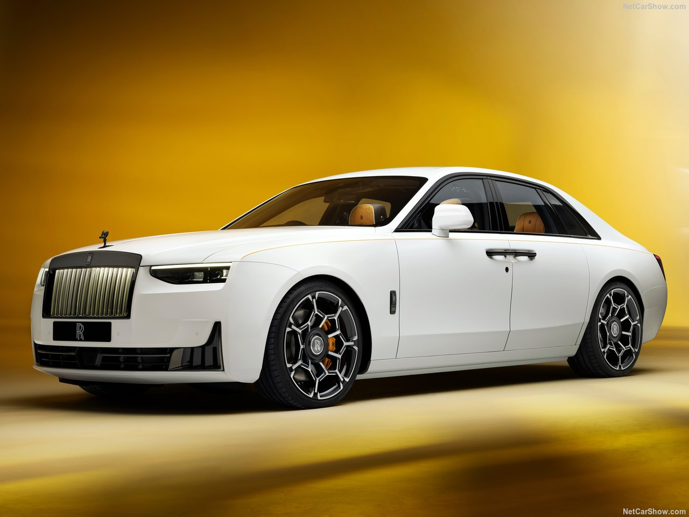

# 🚗 Scroll Animation Car Experience

Scroll Animation Car Experience is a modern front-end project designed to present an interactive automotive experience where users can explore a car's details and sequential visuals simply by scrolling up and down the page.

As the user scrolls, the page smoothly transitions through high-quality exterior angles, design highlights, and an immersive, full interior cabin presentation alongside real-time technical information. Built entirely using vanilla **HTML5**, **CSS3**, and **JavaScript**, this project delivers a sleek, responsive, and visual-first user experience.

## ✨ Features

### 🏎️ Interactive Scroll-Driven Experience
Vehicle visuals and technical details transition smoothly based on the user's scroll position and scrolling speed.

### 🖼️ Sequential Image Rendering
Step-by-step frame progression that gradually unveils the vehicle’s bodywork, styling features, and exterior highlights.

### 🛋️ Detailed Interior Cabin View
Continuing down the scroll sequence transitions from the vehicle's exterior directly into a detailed presentation of the interior cabin and luxury components.

### 📜 Dynamic Content & Specifications
Informational cards and technical specs dynamically fade in and animate in sync with the car's visual progress.

### 🎬 Premium Visual Aesthetics
- Dark, elegant automotive design layout
- Smooth CSS keyframe and opacity transitions
- Clean, minimalist UI/UX focus
- High-contrast typography and polished visual assets

### ⚡ Pure & Lightweight Performance
Built with pure HTML, CSS, and vanilla JS — zero heavy frameworks or external dependencies for optimal loading speed and performance.

## 📸 Preview

<div align="center">
  <a href="https://scrollcar2.netlify.app">
    
  </a>
  <p><i>Click the preview above to view the live website</i></p>
</div>

*Scroll through the live demo to experience the interactive exterior and interior transitions.*

## 🛠️ Built With

| Technology | Purpose |
|------------|---------|
| HTML5 | Semantic structure and clean DOM layout |
| CSS3 | Custom styling, layout design, animations, and transitions |
| JavaScript (ES6+) | Scroll event handling, frame calculations, and dynamic DOM updates |

## 🚀 Getting Started

### Clone the Repository

```bash
git clone https://github.com/muxriddin-web/scroll-cars-2.git
```

### Navigate into the Project Directory

```bash
cd scroll-cars-2
```

### Run the Project

Simply open the `index.html` file in any modern web browser:

```text
index.html
```

No build tools, package installations, or local server setups are required.

## 🎮 How It Works

| Action | Result |
|--------|--------|
| 🖱️ Scroll Down | Advances the image frame sequence and content stream |
| 🖼️ Sequenced Frames | Renders sequential vehicle angles based on scroll offset |
| 🚗 Exterior Presentation | Showcases body contours, lights, and exterior highlights |
| 🏎️ Interior Reveal | Smoothly transitions inside the cabin to reveal interior details |
| ⬆️ Scroll Up | Reverses the animation and frame sequence |

## 💡 Project Highlights

This repository highlights key front-end techniques:

- Scroll-driven image sequence rendering
- JavaScript `window.onscroll` and scroll percentage calculations
- DOM manipulation and dynamic class toggling
- Performance-friendly CSS transitions & GPU acceleration
- Fully responsive web design across viewports
- Clean automotive product showcase UI design

## 📱 Responsive Design

Fully responsive and optimized for:

- 💻 Desktop Displays
- 💼 Laptops
- 📱 Mobile Devices
- 📟 Tablets

## 🌟 Future Roadmap

- [ ] 🎨 Interactive Exterior Color Selector
- [ ] 🔊 Engine Sound & Ambient Cabin Audio Effects
- [ ] 💡 Interactive Headlight & Taillight Toggles
- [ ] 🛞 Wheel & Rim Animation Controls
- [ ] 📊 Expandable Specifications Modal
- [ ] 🌐 Multi-language Support (Uzbek / English / Russian)

## 📂 Project Structure

```text
scroll-cars/
│
├── index.html
├── style.css
├── script.js
│
├── assets/
│   ├── images/       # Frame sequences for exterior & interior views
│
├── Screenshot_1.jpg
├── README.md
└── LICENSE
```

## 🤝 Contributing

Contributions, issues, and feature requests are welcome!

1. Fork the repository
2. Create your feature branch (`git checkout -b feature/AmazingFeature`)
3. Commit your changes (`git commit -m "Add AmazingFeature"`)
4. Push to the branch (`git push origin feature/AmazingFeature`)
5. Open a Pull Request

## 📝 License

This project is distributed under the **MIT License**.

See the `LICENSE` file for more details.

## 📬 Contact & Support

If you have questions, feedback, or would like to connect:

- **Author:** Muxriddin O'tkirov
- **GitHub:** [@muxriddin-web](https://github.com/muxriddin-web)
- **Repository:** [scroll-cars](https://github.com/muxriddin-web/scroll-cars)

---

⭐ **If you like this project, please give it a star on GitHub — it helps a lot!**

> *"Experience the design. Feel every detail with a scroll."*

---

### ❤️ Made with HTML5, CSS3 & JavaScript
